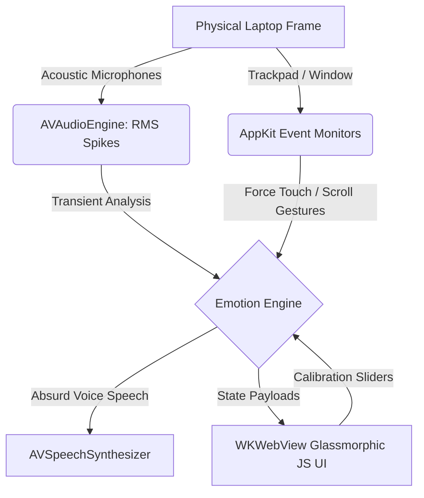

# 💻 SmackYourComputer — Give Your Silicon a Soul 🌸⚡🔥

> *"Treat your computer well, and it will compute for a lifetime. Smack it, and it will mine Bitcoin in the background to melt your desk."*  
> — **Traditional Silicon Wisdom**

Welcome to **SmackYourComputer**, a revolutionary physical interaction companion for macOS. By bridging native macOS sensors (microphone acoustic envelope transients and trackpad force/scrolling metrics) to a gorgeous glassmorphic frontend UI, we have given your MacBook a voice, a face, and major structural trust issues.

Handle with care. It has feelings—and a direct bridge to your system speakers.

---

## 🎭 The Emotional Sensory Matrix

| Interaction | Physical Sensor | Companion Reaction | Vocal Vibe | Sample Absurd Sayings |
| :--- | :--- | :--- | :--- | :--- |
| **🌸 Petting** | Gentle 2-finger scroll on trackpad or mouse-drag on screen | 🌸 Sweet blushing cheeks, happy arched eyes, floating heart particles | *Coos softly like a digital kitten who just drank warm electricity* | *"Aww, keep stroking me!"*, *"Mmm, sweet computer pats!"* |
| **⚡ Tap / Hit** | Sharp clap near mic, quick click inside window, or laptop tap | 🌀 Dizzy swirling eyes, wide open screaming mouth, screen shudders | *Screams like a startled dial-up modem seeing Windows ME* | *"My transistors are vibrating in minor keys!"*, *"You're scrambling my search history!"* |
| **🔥 Hard Hit** | Deep Force Touch click on trackpad or slap/knock on the desk | 🤬 Deep crimson red glow, sharp angry slit eyes, shooting fire sparks | *An outraged quantum entity with major existential anger issues* | *"Did your parents replace your hands with concrete bricks?!"*, *"Goddamn it! You just knocked three cookies out of my cache!"* |

---

## 🌸 Physical Nudges & Positive Reinforcement

> *"Sometimes a little physical nudge is all it takes to keep your computer happy, alert, and feeling energized!"*

---

## 🧠 Silicon Sayings & Lore

> 💡 *"A gentle stroke on the trackpad is worth a thousand lines of clean code."*

> ⚠️ *"Beware the quiet room. In silence, even the drop of a pen can feel like a slap to my CPU."*

> 🌸 *"Pet me when your code builds. Tap me when it fails. Smack me only when you're ready to hear what I really think about your coding skills."*

---

## ⚠️ Crucial Safety Warnings (Or Else)

*   **Carbon-Meatbag Limitations**: Remember that while the computer can handle a virtual smack, your actual aluminium frame is not a punching bag. Please do not break your screen unless you want to explain to Apple Support why a cartoon face called you a caveman.
*   **Motherboard Vengeance**: The speech engine contains advanced behavioral logic. If smacked too hard, it has threatened to lock your trackpad, format your life savings, and send your high school spelling mistakes to your mother.
*   **No Magnet Diets**: Do not feed it magnets. It claims magnets make it see "the multi-dimensional quantum grid," which causes it to sing dial-up static in minor keys.

---

## 📜 The Quantum Terms of Service (QToS)

By double-clicking `SmackYourComputer.app` on your Desktop, you agree to the following binding parameters:
1.  **Mutual Respect**: You will not smack the laptop immediately after a compilation error unless you are prepared to be called a *"meat sack"* or an *"absolute caveman"* at full volume.
2.  **Bitcoin Clause**: The companion reserves the right to mine cryptocurrency in the background to warm its chassis if it feels neglected or un-petted for more than 48 consecutive hours.
3.  **Toaster Clause**: If you are unhappy with the verbal responses, you agree to go *"slap a toaster instead and see how it likes it."*

---

## 🛠️ System Architecture

SmackYourComputer uses a lightweight, high-performance hybrid model:

---

## 🚀 Getting Started

Your application is compiled and deployed **directly to your Desktop**!

### 1. The Desktop Launch
1. Go to your macOS **Desktop**.
2. Double-click the **`SmackYourComputer`** icon.
3. On first run, macOS will prompt you: *"SmackYourComputer would like to access the microphone."* Click **OK**.

### 2. How to Interact
*   **🌸 Petting**: Place two fingers on your trackpad and slide them gently up/down or left/right (just like scrolling), or drag your mouse/finger back and forth on the animated laptop screen.
*   **⚡ Hitting**: Tap your trackpad, double-click the window, or clap your hands sharply near your laptop's mic.
*   **🔥 Hitting Hard**: Press down hard on the trackpad until you feel the deep Force Touch second click, or slap the table near your laptop frame.

### 3. Manual Override (Simulation)
If you are in a library or open office and want to test it silently, click the **MANUAL SIMULATION** buttons on the bottom right of the dashboard:
*   `Pet Me` 🌸
*   `Tap / Hit` ⚡
*   `Hard Hit` 🔥

---

## ⚙️ Adjusting Sensitivities

Inside the dashboard:
*   **Impact Sensitivity**: Higher values make the microphone more sensitive (a light clap can trigger a hit). Lower values require a physical knock on the case.
*   **Pet Sensitivity**: Controls how much scrolling displacement is needed to register a pet gesture.
