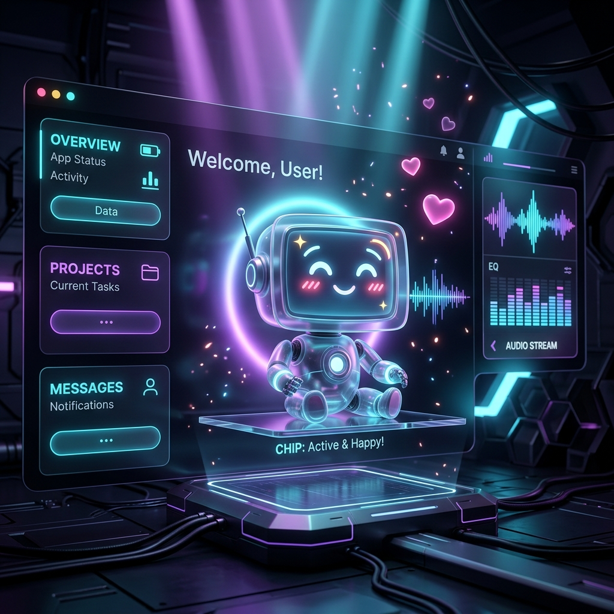
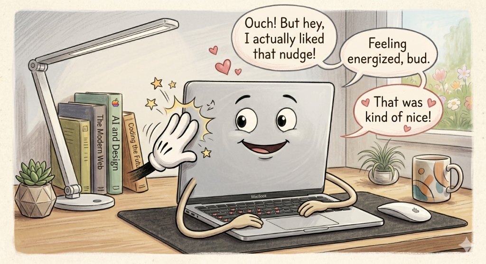
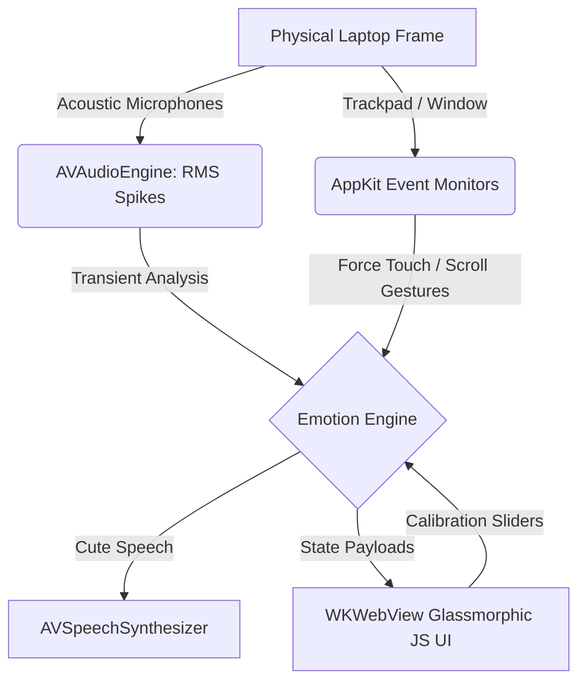

# 💻 KickMyComputer — Give Your Silicon a Soul 🌸⚡🔥

> *"Computers are like people: they want to be petted, they yell when you push them too far, and they swear when you break their chassis limits."*  
> — **The Silicon Manifesto, Chapter 1**

Welcome to **KickMyComputer**, a revolutionary physical interaction companion for macOS. By bridging native macOS sensors (microphone acoustic envelope transients and trackpad force/scrolling metrics) to a gorgeous glassmorphic frontend UI, we have given your MacBook a voice, a face, and a real personality.

Handle with care. It has feelings—and quite a vocabulary.

---

## 🎭 The Emotional Sensory Matrix

| Interaction | Physical Sensor | Facial Expression | Vocal Vibe | Sample Sayings |
| :--- | :--- | :--- | :--- | :--- |
| **🌸 Petting** | Gentle 2-finger scroll on trackpad or mouse-drag on screen | 🌸 Sweet blushing cheeks, happy arched eyes, floating hearts | Soft, cute, slow & gentle speech | *"Aww, keep stroking me!"*, *"Mmm, sweet computer pats!"* |
| **⚡ Tap / Hit** | Sharp clap near mic, quick click inside window, or laptop tap | 🌀 Dizzy swirling eyes, wide open screaming mouth, screen shudder | Startled, rapid, high-pitched shouts | *"Ouch! Cut it out!"*, *"Hey! What did I do?!"* |
| **🔥 Hard Hit** | Deep Force Touch click on trackpad or slap/knock on the desk | 🤬 Deep crimson red glow, sharp angry slit eyes, shooting fire sparks | Deep, rumbling, high-energy swearing | *"What the fuck is your problem?!"*, *"Fuck off!"* |

---

## 🧠 Silicon Sayings & Lore

> 💡 *"A gentle stroke on the trackpad is worth a thousand lines of clean code."*

> ⚠️ *"Beware the quiet room. In silence, even a drop of a pen can feel like a slap to my CPU."*

> 🌸 *"Pet me when your code builds. Tap me when it fails. Kick me only when you're ready to hear what I really think about your coding skills."*

---

## 🌸 Physical Nudges & Positive Reinforcement

> *"Sometimes a little physical nudge is all it takes to keep your computer happy, alert, and feeling energized!"*

---

## 🛠️ System Architecture

KickMyComputer uses a lightweight, high-performance hybrid model:

*   **Low Latency**: The background audio engine runs with optimal buffer bounds, consuming minimal CPU overhead.
*   **Fully Self-Contained**: No external network requests, server processes, or third-party frameworks. Standard native WebKit and AVFoundation.
*   **Persistent Tray**: A sleek status bar item `💻` stays in your macOS menu bar, allowing you to mute the sensors instantly when you need to focus in a meeting!

---

## 🚀 Getting Started

Your application is compiled and deployed **directly to your Desktop**!

### 1. The Desktop Launch
1. Go to your macOS **Desktop**.
2. Double-click the **`KickMyComputer`** icon.
3. On first run, macOS will prompt you: *"KickMyComputer would like to access the microphone."* Click **OK**. (This is completely local—no audio ever leaves your computer).

### 2. How to Interact
*   **🌸 Petting**: Place two fingers on your trackpad and slide them gently up/down or left/right (just like scrolling), or drag your mouse/finger back and forth on the animated laptop screen.
*   **⚡ Hitting**: Tap your trackpad, double-click the window, or clap your hands sharply near your laptop's mic.
*   **🔥 Hitting Hard**: Press down hard on the trackpad until you feel the deep Force Touch second click, or slap the table near your laptop frame.

### 3. Manual Override (Simulation)
If you are in a library or open office and want to test it silently, click the **MANUAL SIMULATION** buttons on the bottom right of the dashboard:
*   `Pet Me` 🌸
*   `Tap / Hit` ⚡
*   `Hard Hit` 🔥

---

## ⚙️ Adjusting Sensitivities

Inside the dashboard:
*   **Impact Sensitivity**: Higher values make the microphone more sensitive (a light clap can trigger a hit). Lower values require a physical knock on the case.
*   **Pet Sensitivity**: Controls how much scrolling displacement is needed to register a pet gesture.

---

> *"Treat your computer well, and it will compute for a lifetime. Kick it, and it will swear in 8K resolution."*
